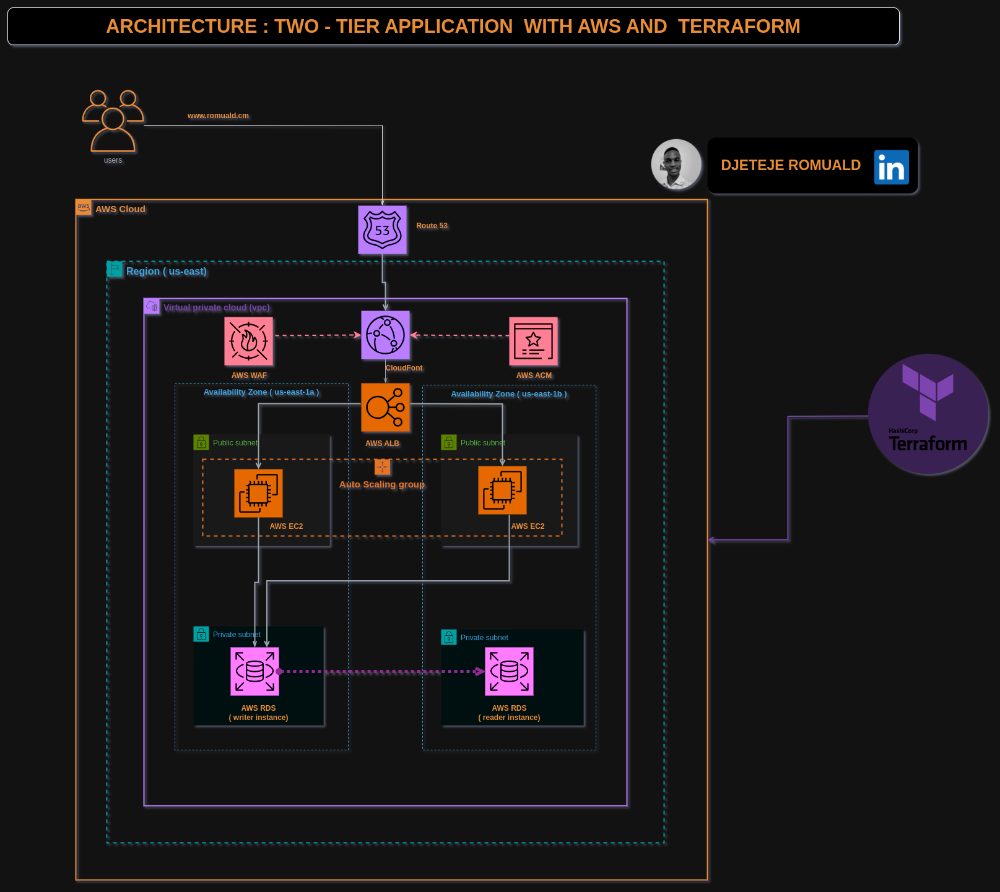

# 🌐 Infrastructure AWS à Deux Niveaux avec Terraform

## 🏗️ Architecture

Voici l'architecture de l'infrastructure AWS à deux niveaux que vous allez déployer :



Cette architecture comprend un VPC avec des sous-réseaux publics et privés, des instances EC2, des groupes Auto Scaling, des NAT Gateways, un Application Load Balancer, et des bases de données managées avec Amazon RDS.

## 📋 Présentation

Bienvenue dans ce projet Terraform conçu pour déployer une architecture à deux niveaux sur AWS ! Ce projet adopte une approche modulaire et axée sur la sécurité pour créer une infrastructure évolutive et facile à maintenir.

## ✨ Fonctionnalités

- 🗂️ **Structure Modulaire** : Le projet est organisé en modules dédiés pour chaque service AWS, favorisant la réutilisabilité et la maintenabilité.
- 🔒 **Sécurité** : Utilisation de rôles et de politiques IAM pour assurer une infrastructure sécurisée.
- 🛠️ **Infrastructure as Code (IaC)** : Déployez et gérez votre infrastructure à l'aide de Terraform, permettant ainsi le contrôle de version et la reproductibilité.
- 🔧 **Modules Spécifiques aux Services** : Chaque module correspond à un service AWS spécifique, permettant une gestion ciblée.

## 🚀 Prise en Main

Suivez ces étapes pour déployer l'architecture à deux niveaux :

### 📥 Cloner le Répertoire

```bash
git clone https://github.com/DJTJ21/Two-Tier-AWS-App.git
cd sweet-app
```

### ⚙️ Planifier et Appliquer

```bash
terraform init
terraform plan -var-file=variables.tfvars
terraform apply -var-file=variables.tfvars --auto-approve
```

### 🧹 Nettoyage

Une fois l'exploration terminée, exécutez la commande suivante pour détruire l'infrastructure :

```bash
terraform destroy -var-file=variables.tfvars --auto-approve
```

## 🌟 Points Forts du Projet

- 🛡️ **VPC : La Fondation** : Créez un Virtual Private Cloud (VPC) robuste pour établir un environnement sécurisé et isolé pour votre application.
  
- ⚖️ **Équilibrage de Charge** : Utilisez la puissance de l'Application Load Balancer (ALB) pour distribuer intelligemment le trafic entrant entre plusieurs instances EC2, assurant une performance optimale et une haute disponibilité.

- 📈 **Auto Scaling** : Profitez du groupe Auto Scaling pour ajuster dynamiquement le nombre d'instances EC2 en fonction de la demande. Cela garantit une mise à l'échelle fluide de votre application, offrant résilience et efficacité économique.

- 💾 **Gestion de Base de Données** : Explorez le monde des bases de données managées avec Amazon RDS. Déployez, mettez à l'échelle et gérez facilement des bases de données relationnelles sans la charge opérationnelle.

- 🌐 **Maîtrise du DNS** : Atteignez l'excellence en gestion de domaine et de DNS avec Amazon Route 53. Connectez vos applications à Internet tout en assurant une haute disponibilité et des réponses à faible latence.

- 🔒 **Protection avec WAF** : Protégez vos applications des exploits web courants et assurez une expérience utilisateur sécurisée avec AWS WAF, un pare-feu applicatif web.

- 🚀 **Accélération CDN** : Améliorez la diffusion de votre contenu à l'échelle mondiale avec un réseau de diffusion de contenu (CDN). Accélérez les temps de chargement, améliorez l'expérience utilisateur et réduisez la latence avec Amazon CloudFront.

- 🔑 **Gestion des Certificats SSL avec ACM** : Assurez une communication sécurisée entre vos utilisateurs et l'application avec Amazon Certificate Manager (ACM). Provisionnez, gérez et déployez facilement des certificats SSL/TLS.

- 🔐 **Sécurité Renforcée avec IAM** : Implémentez des mesures de sécurité robustes avec Identity and Access Management (IAM). Définissez des permissions et des contrôles d'accès granulaires pour sécuriser vos ressources AWS.

- 📜 **Excellence en Infrastructure as Code (IaC)** : Adoptez l'Infrastructure as Code (IaC) avec Terraform, facilitant la provision et la gestion des ressources AWS de manière déclarative et évolutive.

Ces points forts illustrent les services AWS intégrés dans l'architecture à deux niveaux, offrant une base solide pour vos applications avec la sécurité, la scalabilité et la performance au premier plan.


## 🤝 Connectez-vous avec Moi

- **GitHub** : [Profil GitHub](#https://github.com/DJTJ21)
- **LinkedIn** : [Profil LinkedIn](#www.linkedin.com/in/romuald-djeteje)

## ✨ Contributions

N'hésitez pas à contribuer et à adapter ce projet à vos besoins. Vos idées et améliorations sont les bienvenues.

## 📄 Licence

Ce projet est sous licence MIT.

